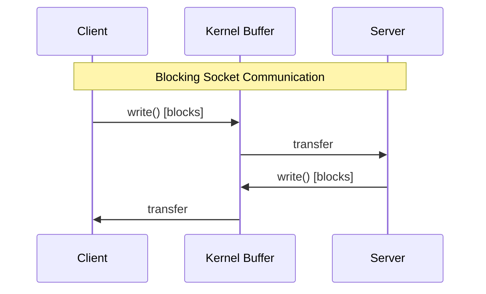
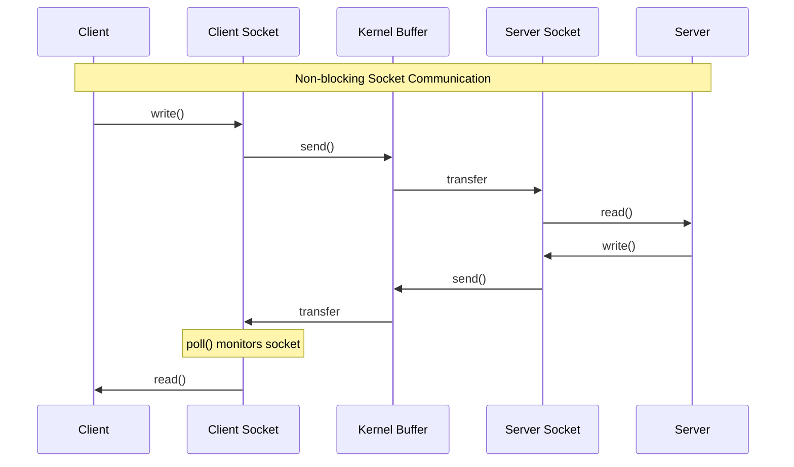
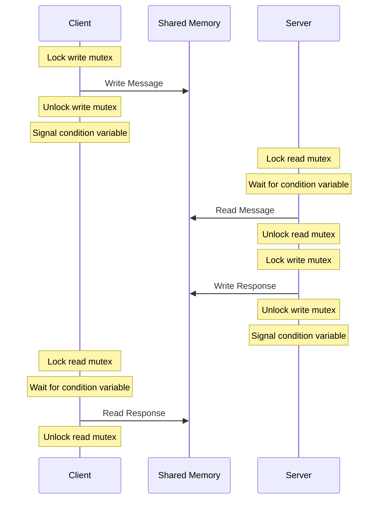
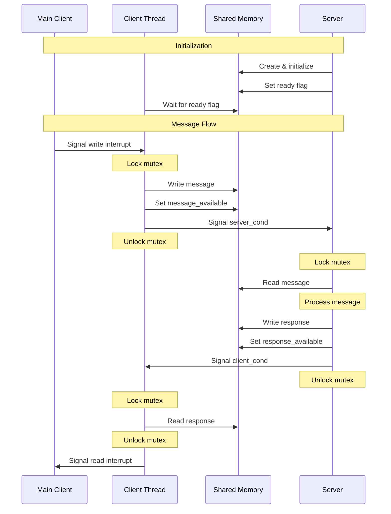
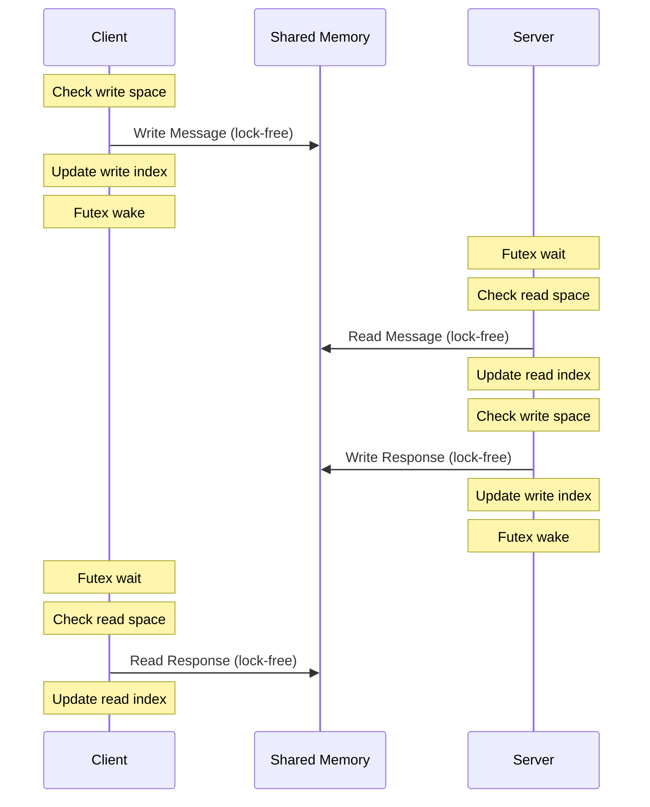
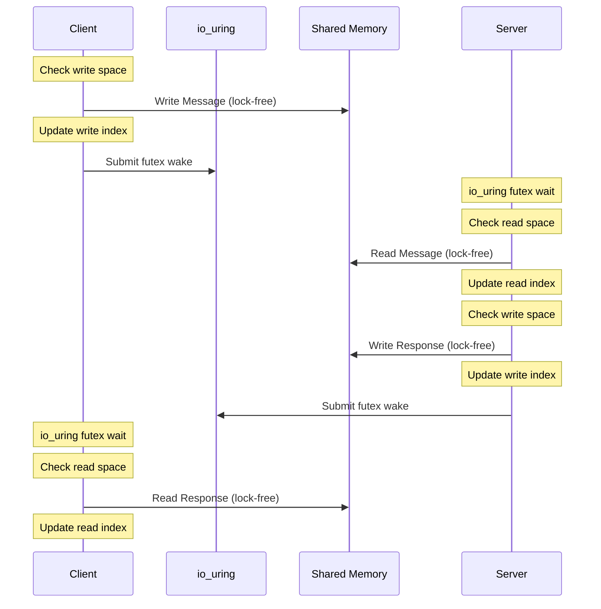

# IPC Benchmark Suite

This benchmark suite compares different IPC (Inter-Process Communication) mechanisms on Unix-like systems, with a focus on performance and latency characteristics.

## Implementations

The suite includes six different IPC implementations, with blocking and non-blocking variants for each core mechanism:

1. **Unix Domain Sockets (UDS)**
   - **Blocking**: Traditional blocking I/O with standard socket operations
   - **Non-blocking**: Uses `poll()` for I/O multiplexing and event-driven design
   - Standard socket-based IPC mechanism
   - Good baseline for comparison

2. **Shared Memory (SHM)**
   - **Blocking**: Direct blocking operations with mutex/condition variables
   - **Non-blocking**: Client thread design with interrupt-based signaling
   - Fixed-size ring buffer (4MB)
   - Message size limit of 2MB (half buffer size)
   - POSIX-compatible implementation

3. **Lock-free Shared Memory (LFSHM)**
   - **Blocking**: Uses futex for direct blocking synchronization
   - **Non-blocking**: Uses `io_uring` for event-driven futex operations
   - Linux-specific implementation
   - Lock-free ring buffer design
   - Optimized for low latency

## Building

```bash
make
```

## Running Benchmarks

Run individual benchmarks:
```bash
# Unix Domain Sockets
make run-uds-blocking      # Blocking UDS
make run-uds-nonblocking   # Non-blocking UDS with select()

# Shared Memory
make run-shm-blocking      # Blocking SHM
make run-shm-nonblocking   # Non-blocking SHM

# Lock-free Shared Memory (Linux only)
make run-lfshm-blocking    # Blocking LFSHM with futex
make run-lfshm-nonblocking # Non-blocking LFSHM with io_uring
```

Run all benchmarks sequentially:
```bash
make run-all
```

## Implementation Details

### Unix Domain Sockets (UDS)

#### Blocking UDS
Uses traditional blocking I/O with standard socket operations:
- Blocking `read()` and `write()` calls
- Simple synchronous communication
- Standard socket-based IPC mechanism
- Messages flow through kernel socket buffers



#### Non-blocking UDS
Uses `poll()` for I/O multiplexing:
- Non-blocking socket operations
- Event-driven design with `poll()`
- Integrates well with event loops
- Efficient I/O multiplexing



### Shared Memory (SHM)

#### Blocking SHM
Uses direct blocking operations with mutex/condition variables:
- Synchronous read/write operations
- Direct blocking synchronization
- Simple and efficient for synchronous workloads
- POSIX-compatible implementation



#### Non-blocking SHM
Uses a client thread with interrupt-based signaling:
- Client thread handles shared memory operations
- Interrupt-based communication
- Fully event-driven design
- Clean separation of concerns



### Lock-free Shared Memory (LFSHM)

The implementation is "lock-free" in terms of its data structure operations (using atomic operations for the ring buffer), but uses `futex` for efficient thread waiting/waking. While `futex` is a synchronization primitive, it's used here for notification rather than mutual exclusion - the actual data access remains lock-free.

#### Blocking LFSHM
Uses futex for direct blocking synchronization:
- Linux-specific implementation using futex
- Lock-free ring buffer design
- Direct blocking with futex operations
- Optimized for low latency



#### Non-blocking LFSHM
Uses `io_uring` for event-driven futex operations:
- Linux-specific implementation using io_uring
- Lock-free ring buffer with io_uring integration
- Event-driven futex operations
- Optimal performance with event loop integration



## Comparison

The implementations showcase different approaches to IPC with varying trade-offs:

1. **Unix Domain Sockets**
   - **Blocking**: Simple, reliable baseline with minimal complexity
   - **Non-blocking**: Uses `poll()` for I/O multiplexing
   - Most portable option across Unix-like systems

2. **Shared Memory**
   - **Blocking**: Maximum throughput for POSIX shared memory
   - **Non-blocking**: Clean event-driven design with client thread
   - Good balance of performance and portability

3. **Lock-free Shared Memory**
   - **Blocking**: Optimal performance with futex operations
   - **Non-blocking**: Best-in-class performance with `io_uring`
   - Linux-specific but highest performance

### Benchmark Results

Tests run on a CPU-constrained Linux VPS (limited to ~50% CPU usage) with two different configurations:

#### No Server Processing (0s work)

| Implementation    | Ops/sec | Throughput | CPU Usage | Avg Latency | P99 Latency |
|------------------|---------|------------|-----------|-------------|-------------|
| UDS Blocking     | 20,233  | 59.95 MB/s | 62.47%    | 43.26 µs   | 231.00 µs   |
| UDS Non-blocking | 21,142  | 62.64 MB/s | 57.74%    | 41.09 µs   | 227.00 µs   |
| SHM Blocking     | 18,919  | 56.06 MB/s | 43.91%    | 36.13 µs   | 224.00 µs   |
| SHM Non-blocking | 12,311  | 36.49 MB/s | 54.76%    | 58.72 µs   | 252.00 µs   |
| LFSHM Blocking   | 21,528  | 63.78 MB/s | 44.96%    | 31.01 µs   | 210.00 µs   |
| LFSHM Non-blocking| 20,762 | 61.51 MB/s | 46.09%    | 32.36 µs   | 213.00 µs   |

#### With Server Processing (1ms work)

| Implementation    | Ops/sec | Throughput | CPU Usage | Avg Latency | P99 Latency |
|------------------|---------|------------|-----------|-------------|-------------|
| UDS Blocking     | 876     | 2.60 MB/s  | 3.33%     | 1134.73 µs | 1323.00 µs  |
| UDS Non-blocking | 879     | 2.61 MB/s  | 2.92%     | 1130.52 µs | 1320.00 µs  |
| SHM Blocking     | 701     | 2.08 MB/s  | 2.00%     | 1134.79 µs | 1324.00 µs  |
| SHM Non-blocking | 676     | 2.01 MB/s  | 3.89%     | 1175.17 µs | 1386.00 µs  |
| LFSHM Blocking   | 704     | 2.09 MB/s  | 1.88%     | 1127.66 µs | 1319.00 µs  |
| LFSHM Non-blocking| 702    | 2.08 MB/s  | 2.05%     | 1131.81 µs | 1321.00 µs  |

### Key Observations

1. **No Processing Load**:
   - Lock-free implementations show best raw performance (LFSHM Blocking: 21.5K ops/sec)
   - UDS performs surprisingly well (Non-blocking: 21.1K ops/sec)
   - SHM Non-blocking shows higher overhead due to client thread design
   - CPU usage varies significantly (43-62%)

2. **With Processing Load (1ms)**:
   - All implementations converge to ~700-880 ops/sec (limited by 1ms work)
   - UDS slightly outperforms in throughput
   - CPU usage drops significantly (1.88-3.89%)
   - Latencies become dominated by processing time (~1.1-1.3ms)

3. **Implementation Trade-offs**:
   - Non-blocking variants don't show significant advantages under load
   - Lock-free design shows benefits in raw performance but diminishes under load
   - **UDS provides good performance with simpler implementation**
   - CPU efficiency varies more in no-load scenario

These results suggest that under real-world conditions with processing overhead, the choice of IPC mechanism might matter less than other architectural decisions. The simpler UDS implementation performs competitively while being more portable.

## License

This project is licensed under the MIT License.
