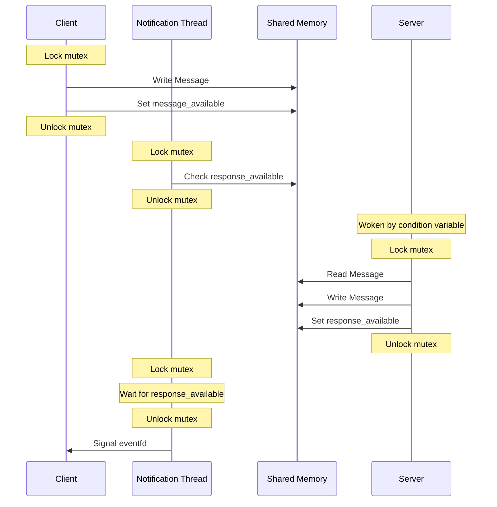
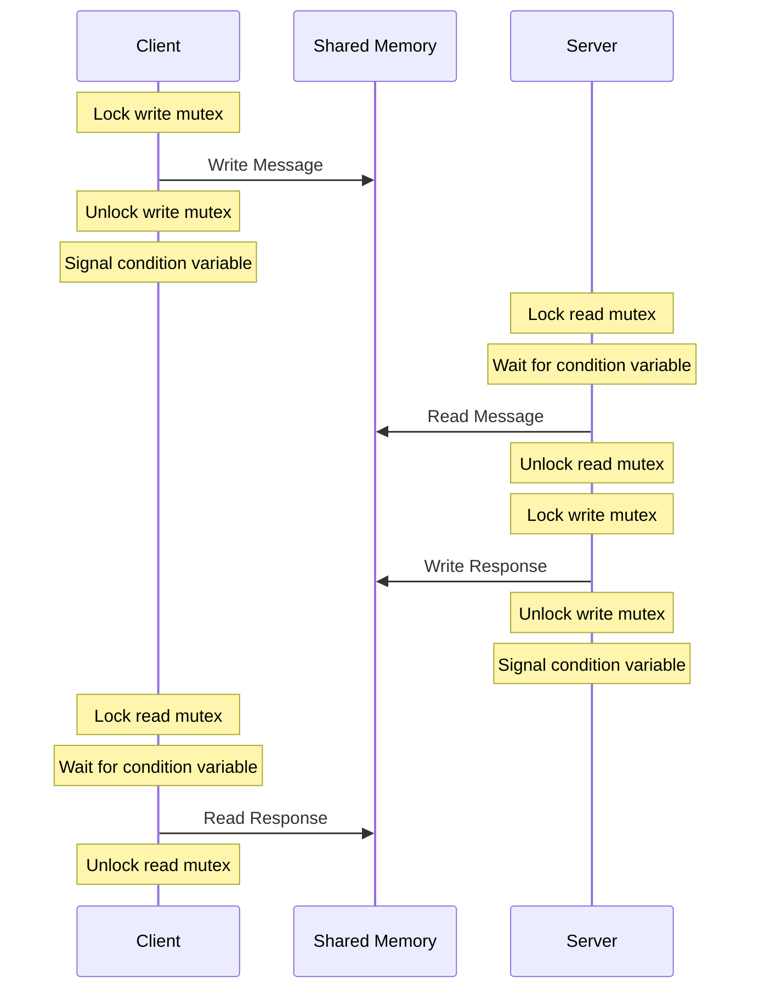
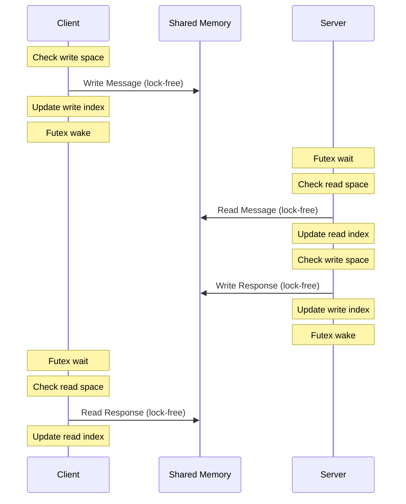

# IPC Benchmark Suite

This benchmark suite compares different IPC (Inter-Process Communication) mechanisms on Unix-like systems, with a focus on performance and latency characteristics.

## Implementations

The suite includes four different IPC implementations:

1. **Unix Domain Sockets (UDS)**
   - Uses `select()` for I/O multiplexing
   - Standard socket-based IPC mechanism
   - Good baseline for comparison

2. **Shared Memory with Pthread (SHM)**
   - Uses pthread mutex and condition variables
   - Dedicated notification thread
   - Eventfd-based signaling

3. **Blocking Shared Memory (BSHM)**
   - Uses pthread mutex and condition variables
   - Direct blocking operations without notification thread
   - Separate mutexes for read/write operations

4. **Lock-free Shared Memory (LFSHM)**
   - Linux-specific implementation using futex
   - Lock-free ring buffer design
   - Optimized for low latency

## Building

```bash
make
```

## Running Benchmarks

Run individual benchmarks:
```bash
make run-uds    # Unix Domain Sockets
make run-shm    # Shared Memory with pthread
make run-bshm   # Blocking Shared Memory
make run-lfshm  # Lock-free Shared Memory (Linux only)
```

Run all benchmarks sequentially:
```bash
make run-all
```

## Implementation Details

### Unix Domain Sockets (UDS)

Uses a unix domain socket for reading and writing messages between the client and server. It has decent performance and integrates directly with the event loop with minimal effort.

- Uses `select()` for I/O multiplexing on the client.
- Uses blocking I/O on the server.
- Standard socket-based IPC mechanism.
- Messages flow through kernel socket buffers.


### Shared Memory with Notification Thread (SHM)

Uses shared memory with a shared mutex for signalling between the client and server. A dedicated notification thread is needed for coordinating with the event loop. Note that this implemenation is still not fully event driven due to the fact that the client locks the mutex in the first instance, but it's sufficiently event-driven for the sake of this comparison.

- Uses pthread mutex and condition variables.
   - Dedicated notification thread for signaling the event loop.
- Fixed-size ring buffer (4MB).
- Message size limit of 2MB (half buffer size).
- Messages flow through shared memory with kernel-assisted synchronization.



### Blocking Shared Memory (BSHM)

Uses shared memory and blocking operations, shows the maximum throughput of a POSIX compatible shared memory implementation.

- Uses pthread mutex and condition variables.
- Direct blocking operations without notification thread.
- Fixed-size ring buffer (4MB).
- Message size limit of 2MB (half buffer size).
- Simpler synchronization model than SHM.
- Messages flow through shared memory with direct blocking synchronization.



### Lock-free Shared Memory (LFSHM)

Uses lock-free shared memory with futexes for coordination. Shows the absolute best possible performance possible. In principle, we could implement a client using io_uring's `io_uring_prep_futex_wait` and `io_uring_prep_futex_wake` operations for event loop integration.

- Linux-specific implementation using futex
- Lock-free ring buffer design
- Optimized for low latency
- Fixed-size ring buffer (4MB)
- Message size limit of 2MB (half buffer size)
- Requires Linux kernel support
- Messages flow through shared memory with lock-free synchronization



## Comparison


## License

This project is licensed under the MIT License.
